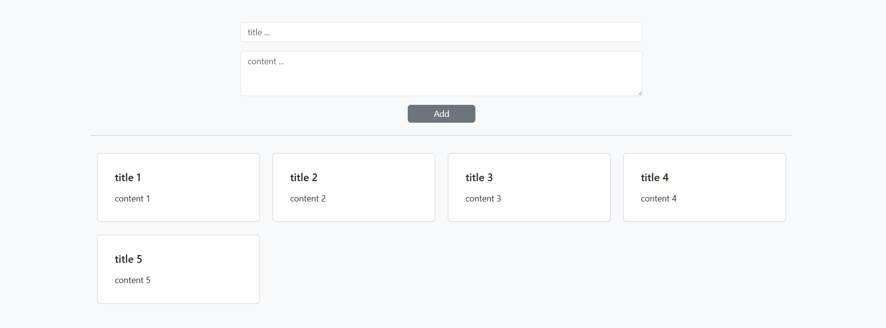

# note-box
A basic CRUD app for notes — built with Laravel Livewire. No client, just a personal project.

## Screenshot

  

## Guide
1. Clone the project
2. Run `composer install`
3. Create a .env file
4. Run `php artisan migrate`
5. Run `php artisan serve` and visit the project in your browser
